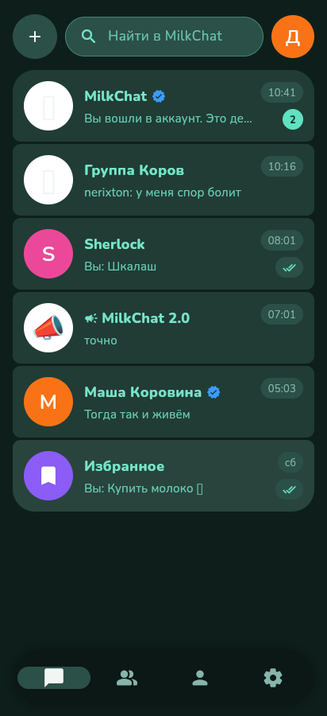
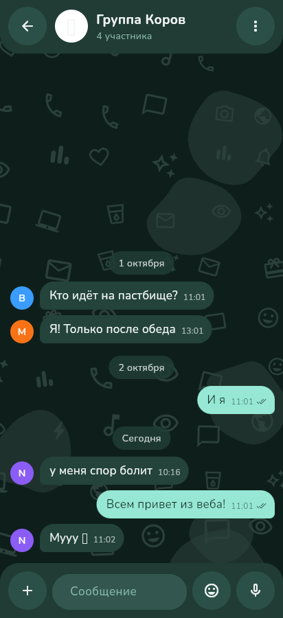
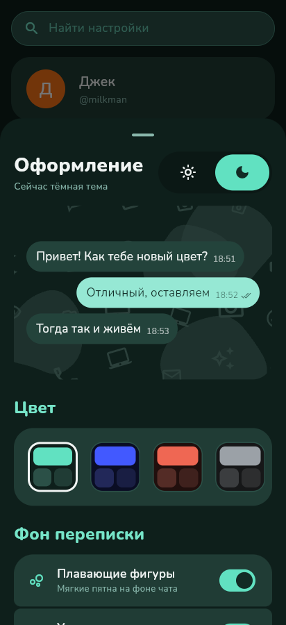
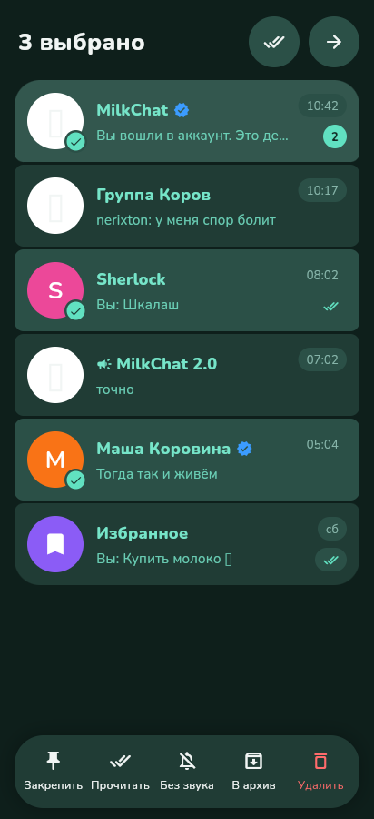
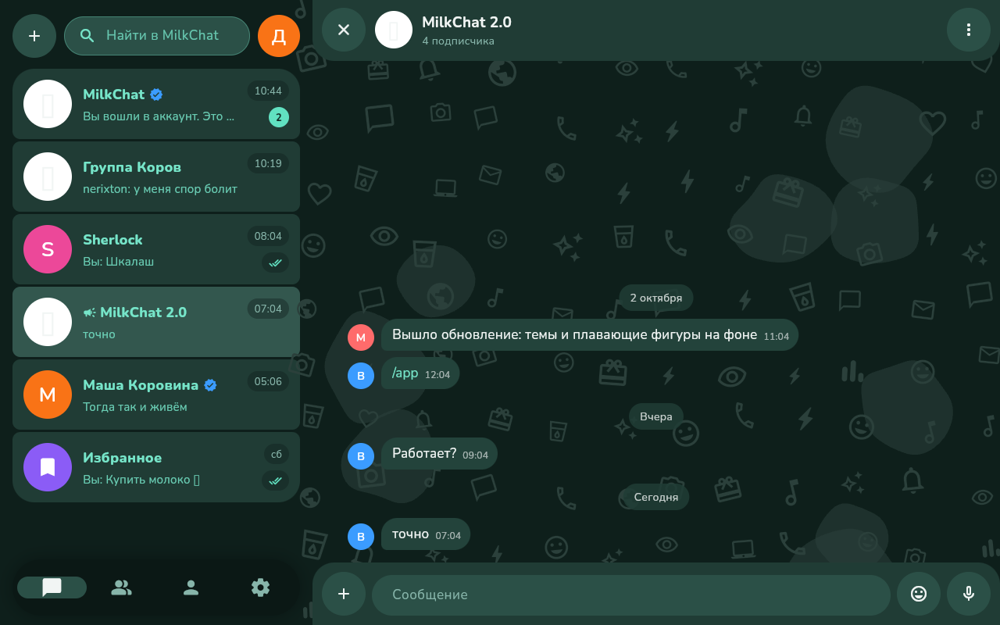

# MilkChat 🥛

Мессенджер и соцсеть для **Android, веба и десктопа** на одной кодовой базе Flutter.
Сервер — [Firebase](https://firebase.google.com) (проект `milkchat-915d4`): Authentication, Firestore, Storage.
Веб-версия: https://milk.lozhka.fun

| Чаты | Переписка | Оформление | Выделение |
|---|---|---|---|
|  |  |  |  |



## Что умеет

- Регистрация и вход по почте с подтверждением адреса, сброс пароля, вход через Google.
- Личные чаты, группы и каналы — создаёт сам пользователь. Официальный канал MilkChat.
- Сообщения в реальном времени, отметки о прочтении; ответ, пересылка, редактирование и удаление у всех.
- Публичные каналы с юзом (@имя): поиск, подписка, назначение администраторов.
- Выделение чатов: закрепить, прочитать, без звука, в архив, удалить.
- Профиль с аватаркой (Firebase Storage), настройки и лист «Оформление».

## Firebase

| Файл | Что это |
|---|---|
| `lib/firebase_options.dart` | публичный конфиг веб-приложения (не секрет) |
| `firestore.rules`, `storage.rules` | правила доступа; проверка — `tool/rules-test` |
| `firebase.json`, `.firebaserc` | для `firebase deploy --only firestore:rules,storage` |
| `tool/admin/verify.mjs` | галочка и роль модератора через Custom Claims (запускается владельцем) |

Структура Firestore: `users`, `usernames`, `user_settings/{uid}/chats`, `chats` (личные, группы,
каналы) с подколлекцией `messages`, `reports`.

## Вход через Google на Android и компьютере

| Платформа | Как работает | Что нужно настроить |
|---|---|---|
| Веб | всплывающее окно Firebase | ничего |
| Android | `signInWithProvider` (Custom Tabs) | постоянный ключ подписи: секреты `ANDROID_KEYSTORE_BASE64` и `ANDROID_KEYSTORE_PASSWORD`; его SHA-1 и SHA-256 — в Android-приложении Firebase (пакет `com.milkchat.milkchat`) |
| Windows, macOS | браузер → ответ на `127.0.0.1` (PKCE) → `signInWithCredential` | OAuth-клиент Google типа «Desktop app» в проекте milkchat-915d4: секреты `GOOGLE_DESKTOP_CLIENT_ID` и `GOOGLE_DESKTOP_CLIENT_SECRET` |
| Linux | — | Firebase SDK для Linux не существует |

SHA-1 подписи каждой Android-сборки выводится в Summary задачи `android` workflow «Build apps».

## Сборка и выкладка на REG.RU

Workflow [`build-web.yml`](.github/workflows/build-web.yml) собирает `flutter build web --release --base-href /`
и сохраняет артефакт **milkchat-web** (вместе с `.htaccess`). Его содержимое загружается в корень
сайта `milk.lozhka.fun` в ISPmanager. Остальные платформы собирает [`build.yml`](.github/workflows/build.yml).

Локально: `flutter pub get && flutter run -d chrome`.

## Структура

```
lib/
  data/        FirebaseRepository и общий интерфейс ChatRepository
  models/      пользователь, чат, сообщение
  screens/     экраны: вход, чаты, переписка, контакты, профиль, настройки, темы
  theme/       палитра из акцентного цвета, светлая и тёмная темы
  widgets/     аватарки, плитки, фон с узором, логотип
web/.htaccess  SPA-fallback, HTTPS и кэш для Apache
tool/          иконки, админ-скрипт, тест правил
```

Шрифт Nunito — SIL Open Font License (`assets/fonts/OFL.txt`).
